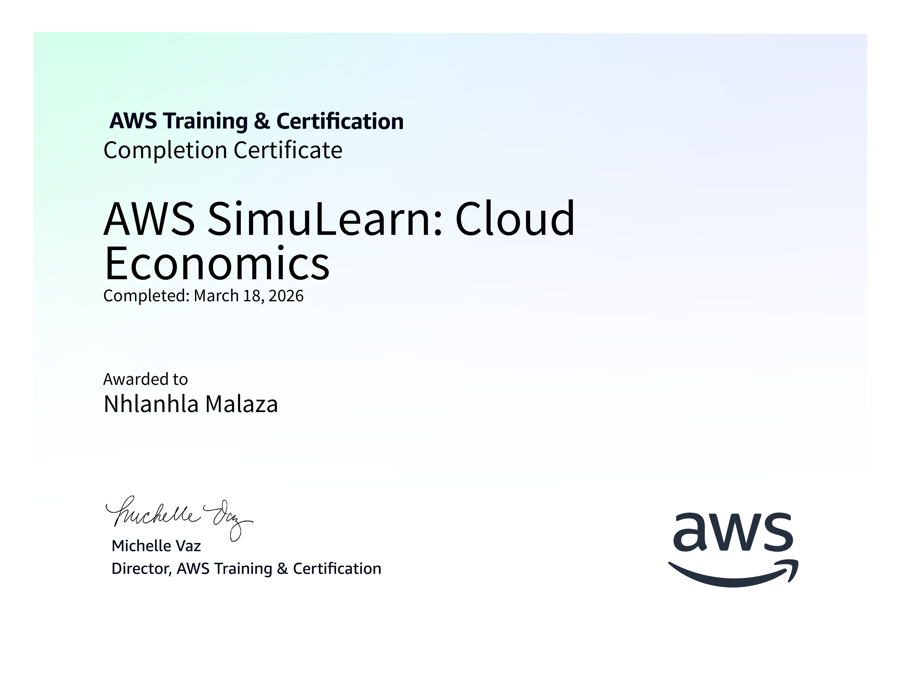
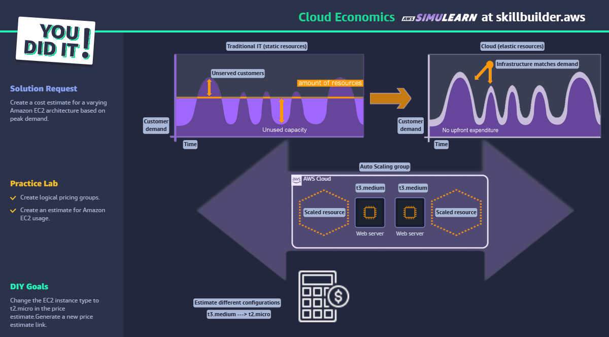

# AWS SimuLearn: [Cloud Economics](https://skillbuilder.aws/learn/34JD3AJ1GA/aws-simulearn-cloud-economics/ETYKA5GAU4?parentId=1UQVR262ZB)

In this AWS SimuLearn project, I learned to design and estimate costs for a scalable cloud architecture tailored to a retail business case. By interacting with the AI-generated customer, I practiced translating technical AWS concepts into clear business value and gathered specific functional requirements. The transition to the live AWS Management Console allowed me to move from theory to practice by manually provisioning and validating resources like load balancers and auto-scaling groups. Overall, this reinforced my ability to manage the full lifecycle of a cloud solution, from initial stakeholder consultation to technical deployment. This experience bridged the gap between architectural design and real-world implementation under professional constraints.

## Certificate

- [View PDF Document](./assets/21c0f0d8-630d-41ff-94ec-1daeffdb9a4c.pdf)

- 

## Lab completed

- 

