# EC2 Setup Project

## Navigation

- [⬆ Parent:](../README.md)
- [🏠 Root:](../../README.md)
- [📂 Current:](./README.md)

## Overview

This project documents the configuration steps I followed and verification I completed for the AWS EC2 laboratory environment.

## 📋 Instructions

For a detailed step-by-step guide on how I configured this environment, please refer to the documentation:

- [View My Instructions](./Instructions.md)

## Contents

- `assets/` - Screenshots and supporting materials I captured
- `Instructions.md` - Detailed lab instructions I followed

---

## ✅ Lab Completion Results

The following images document my successful completion of the AWS EC2 Lab.

### Documentation Gallery

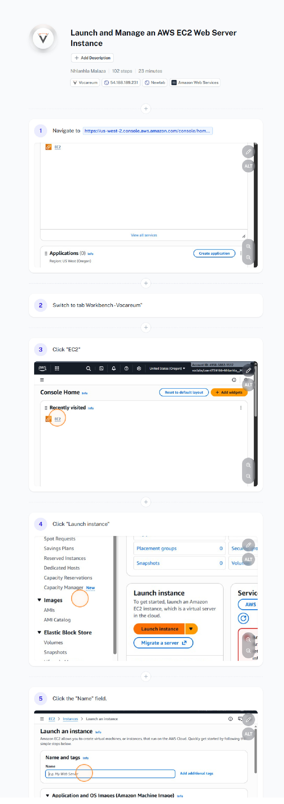
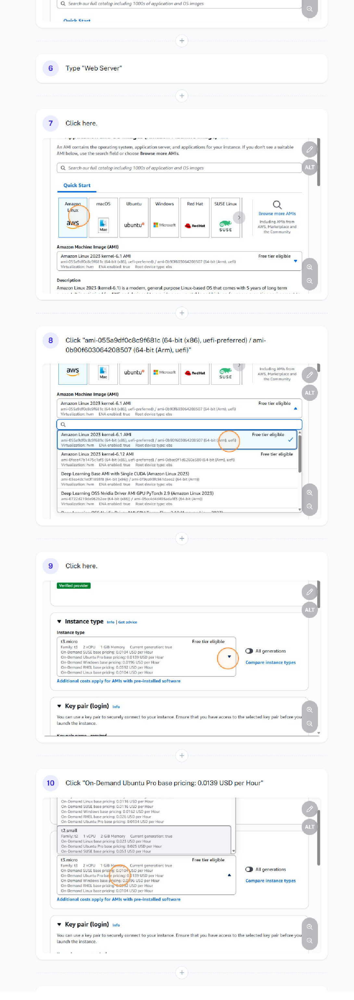
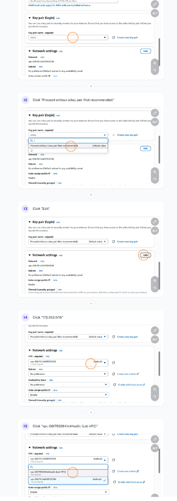
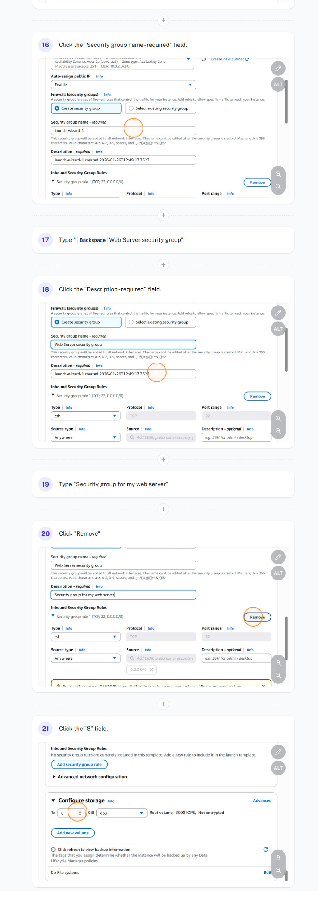
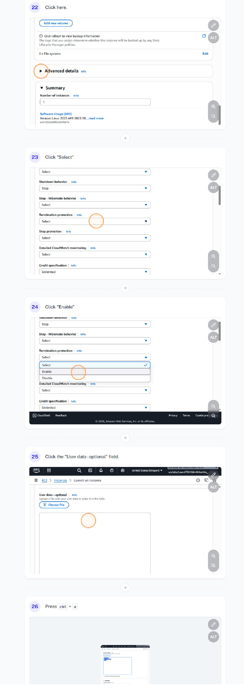
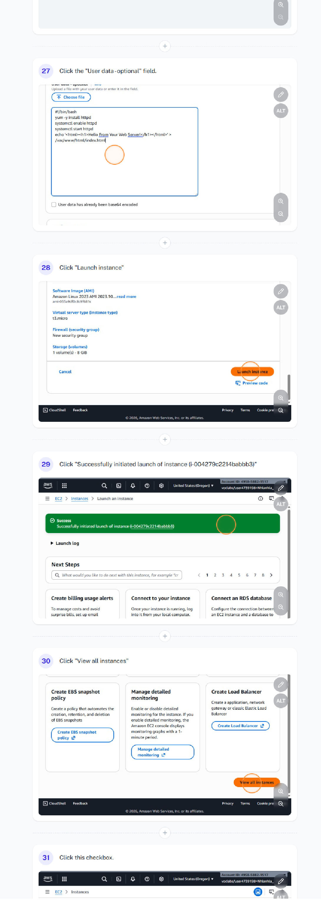
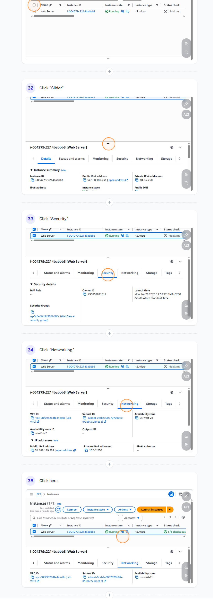
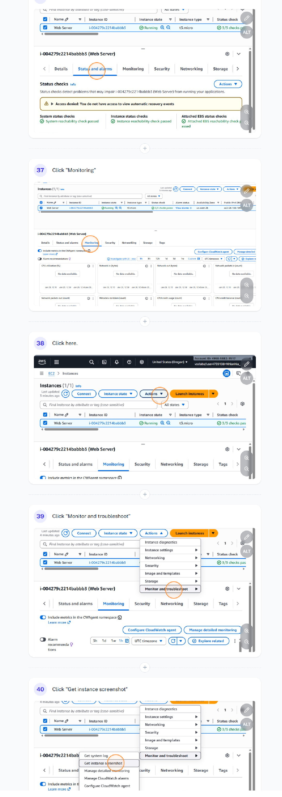
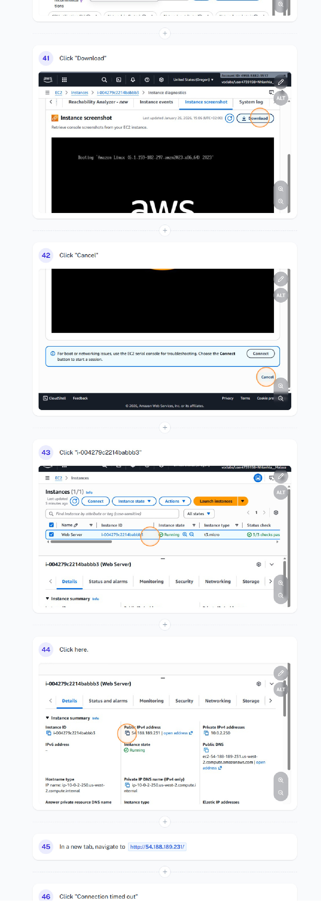
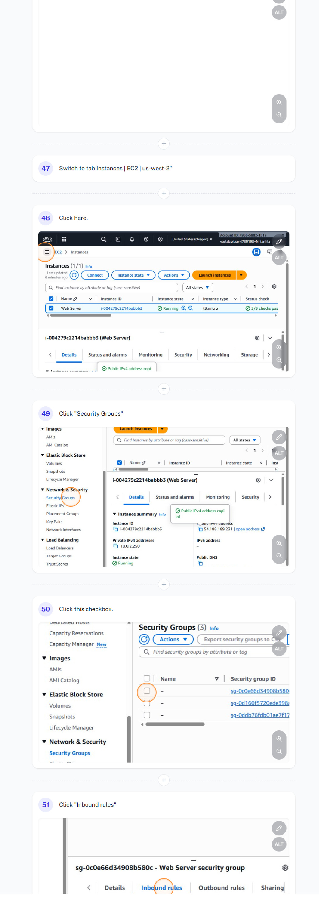
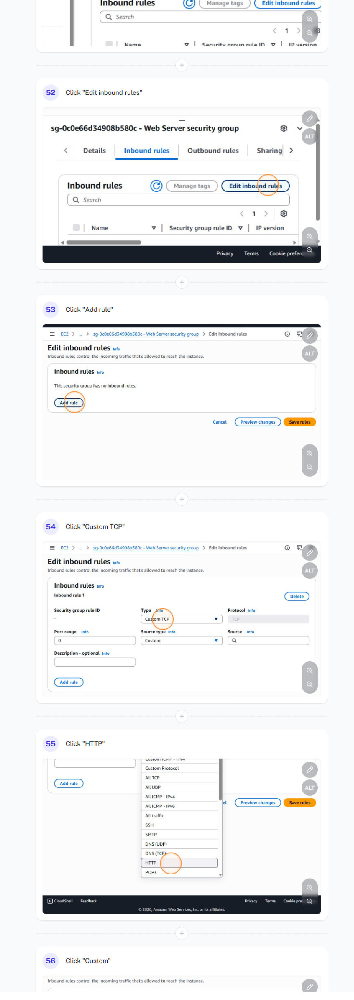
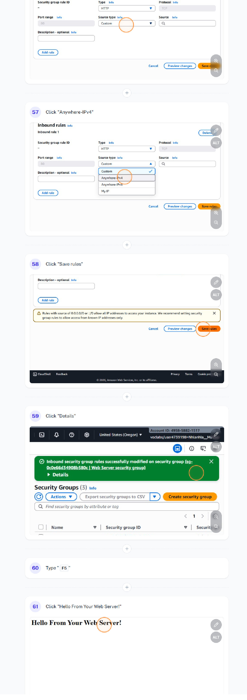
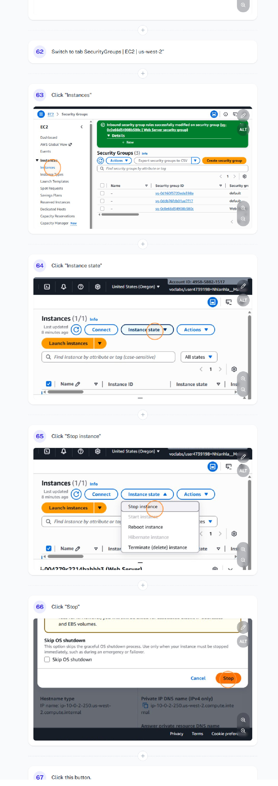
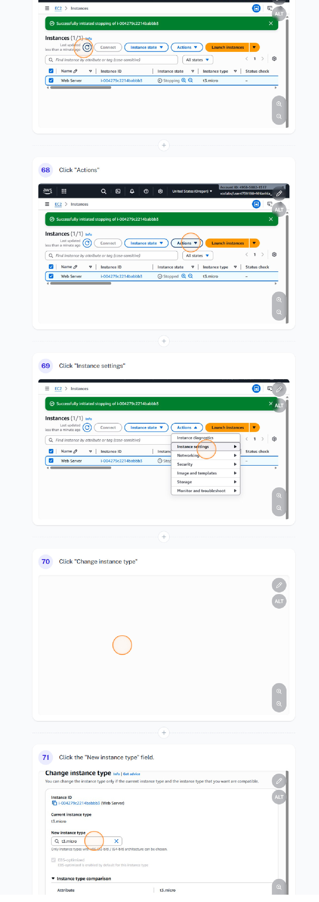
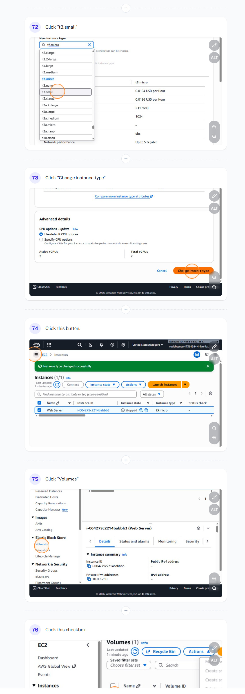
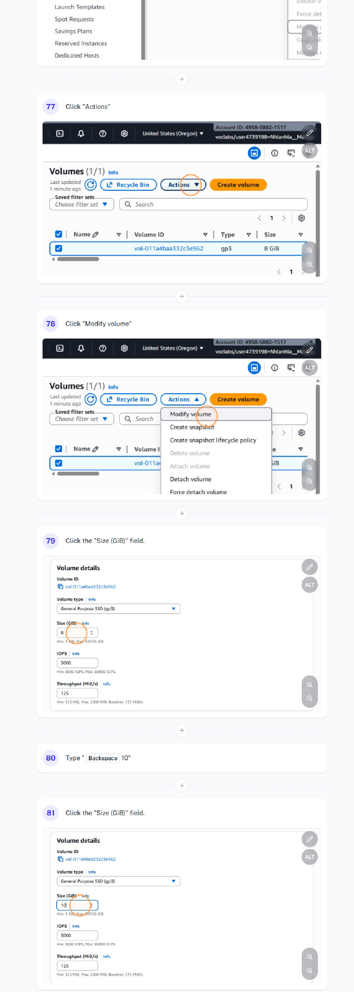
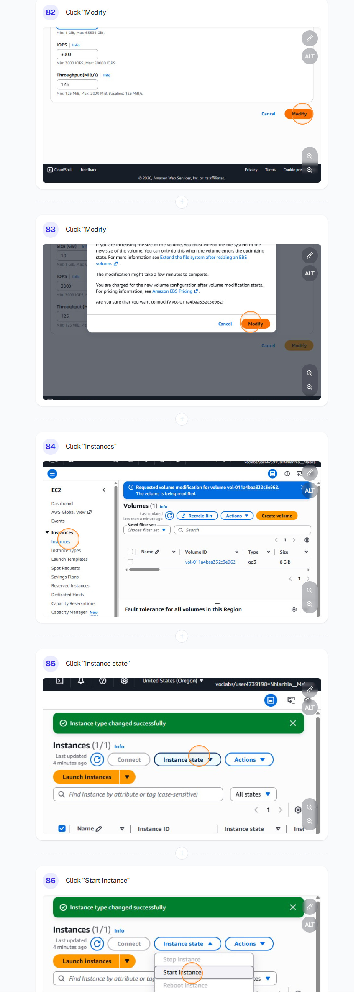
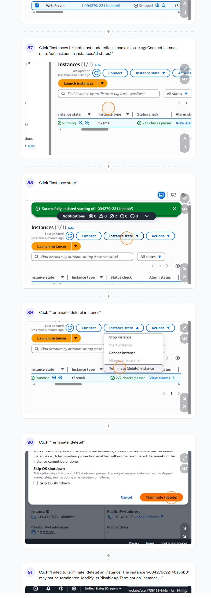
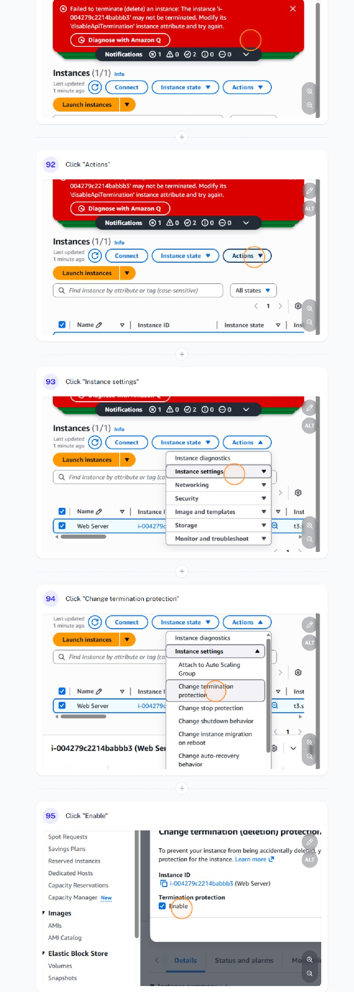
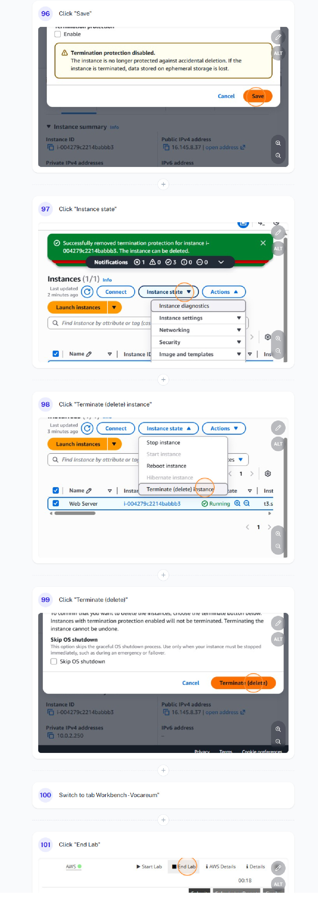

