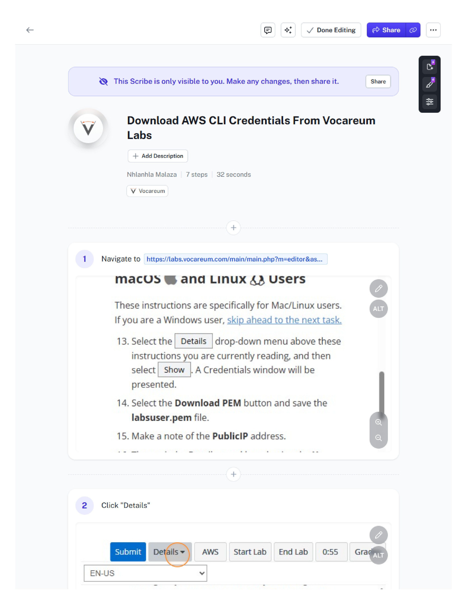
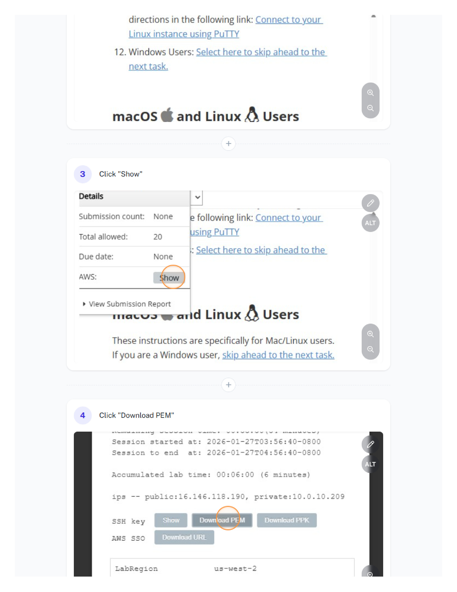
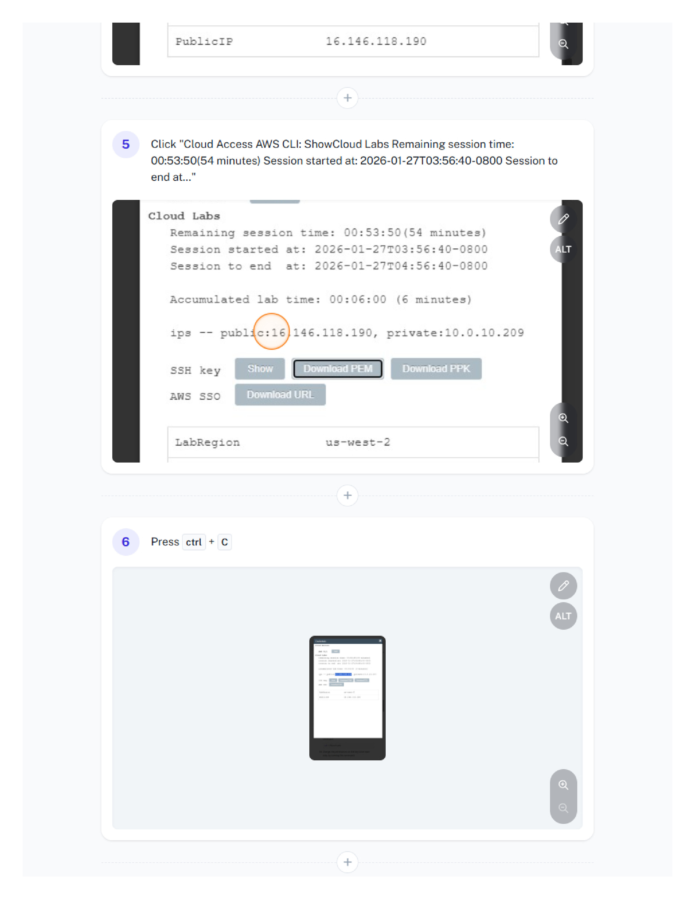
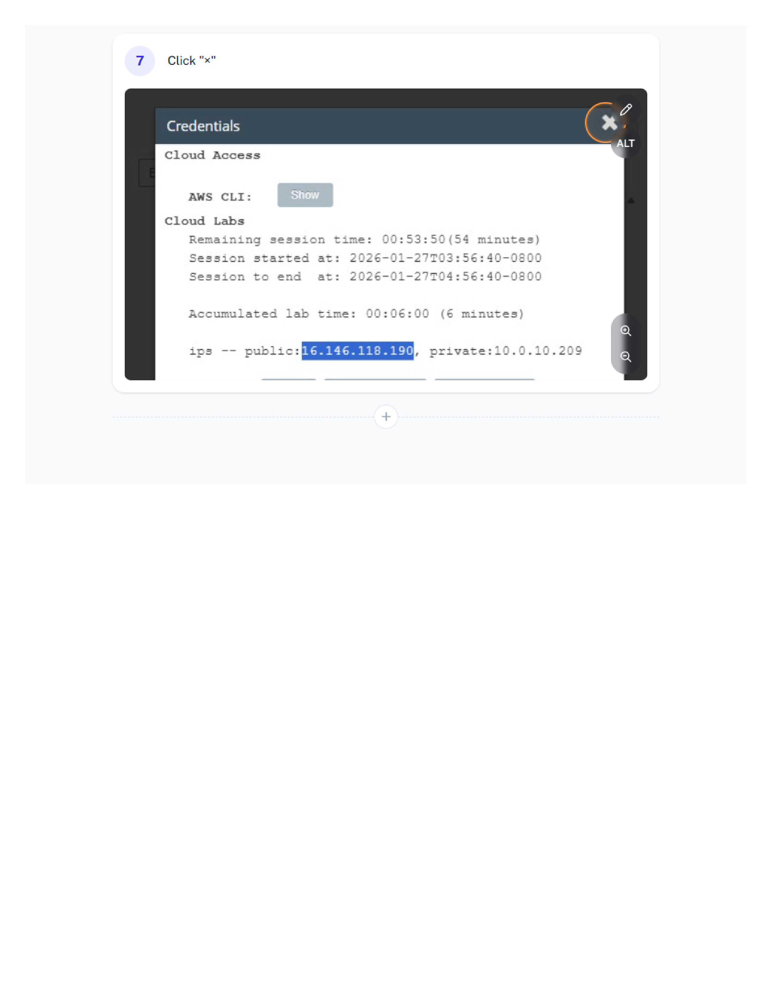
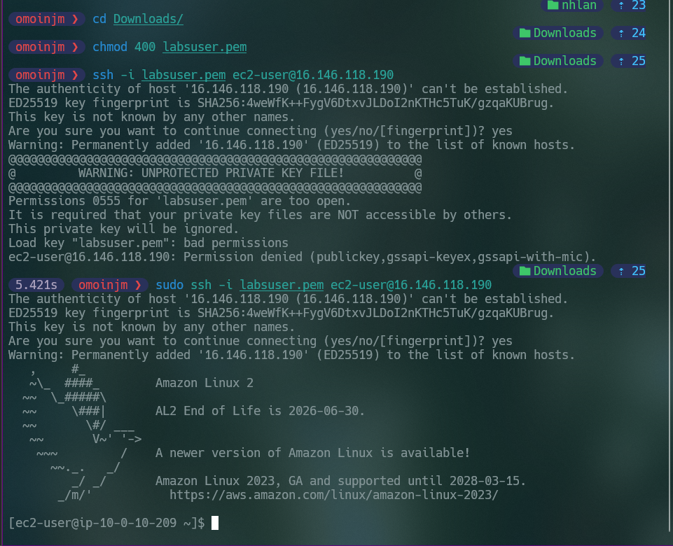
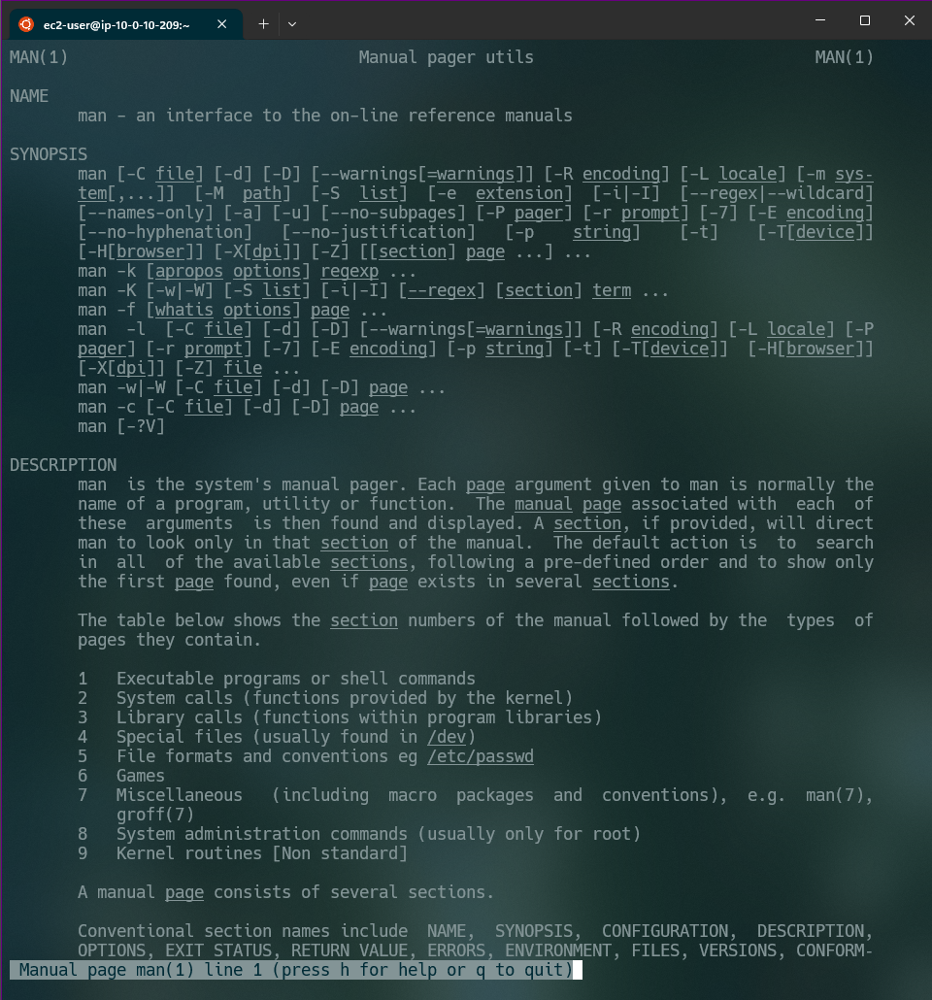

# Introduction to an Amazon Linux Amazon Machine Image (AMI)

## Navigation

- [⬆ Parent](../README.md)
- [🏠 [Root](../../README.md)
- [📂 [Current](./README.md)

## Overview

This lab helped reinforce my knowledge of the basic command line interface functionality and provided a solid foundation from which I could continue to learn about new commands and capabilities within the Linux shell.

## 📋 Instructions

For a detailed step-by-step guide on how I configured this environment, please refer to the documentation:

- [View My Instructions](./Instructions.md)

## Contents

- `assets/` - Screenshots and supporting materials I captured
- `Instructions.md` - Detailed lab instructions I followed

---

## ✅ Lab Completion Results

The following images document my successful completion of the AWS EC2 Lab.

### Documentation Gallery

#### Task 1: Use SSH to connect to an Amazon Linux EC2 instance

---

#### Task 2: Exercise - Explore the Linux man pages

