# Editing Files

## Navigation

- [⬆ Parent](../README.md)
- [🏠 Root](../../README.md)
- [📂 Current](./README.md)

## Overview

After completing this lab, you will be able to:

- Use the vimtutor executable to conduct tasks 1-4
- Copy content from the /var/log/secure file, and edit it with nano

## 📋 Instructions

For a detailed step-by-step guide on how this environment was configured, please refer to the documentation:

- [View Instructions](./task.md)

## Contents

- `assets/` - Screenshots and supporting materials
- `task.md` - Detailed lab instructions

## ✅ Lab Completion Results

The following images document the successful completion of the Managing Users and Groups Lab.

### Task 1: Use SSH to connect to an Amazon Linux EC2 instance

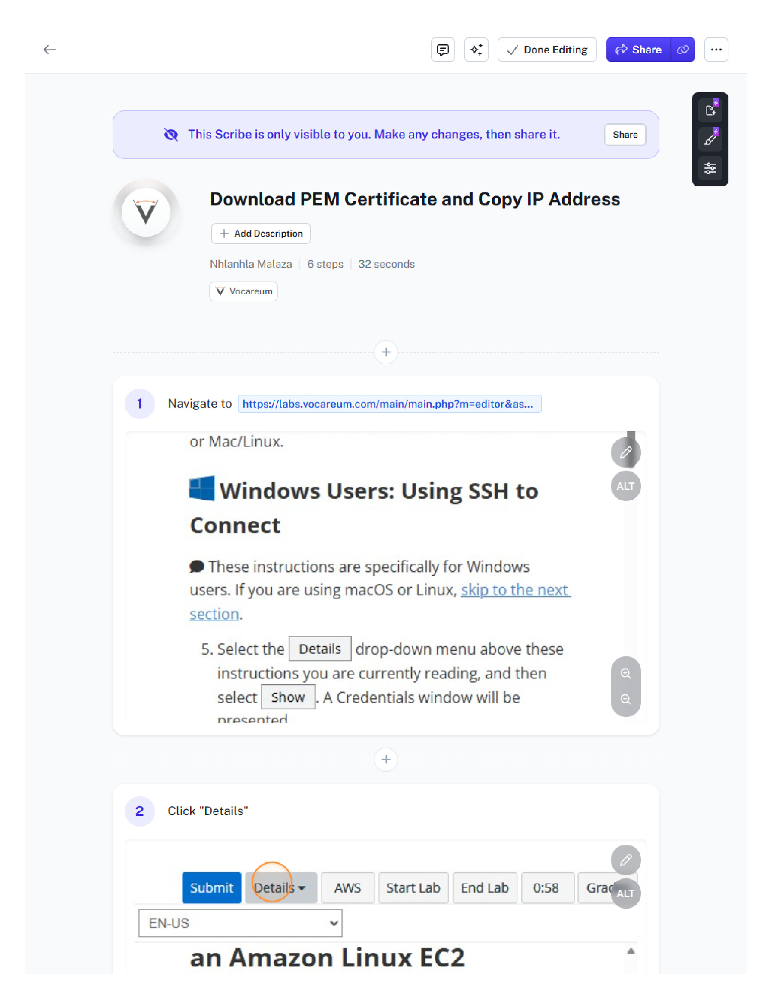
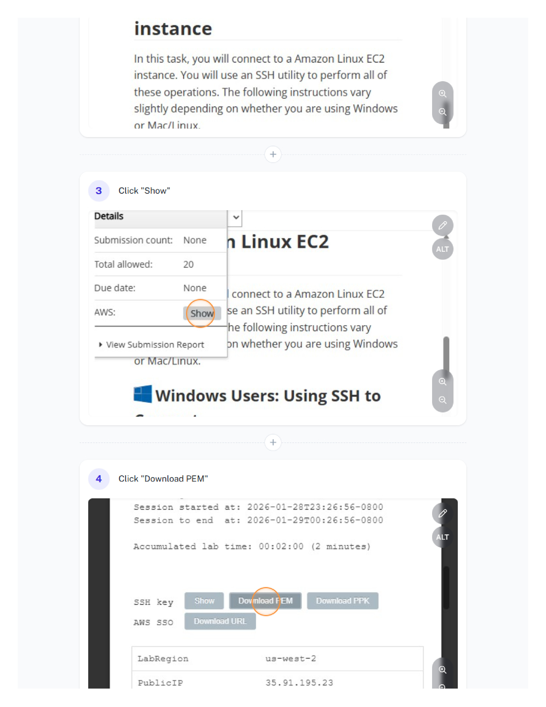
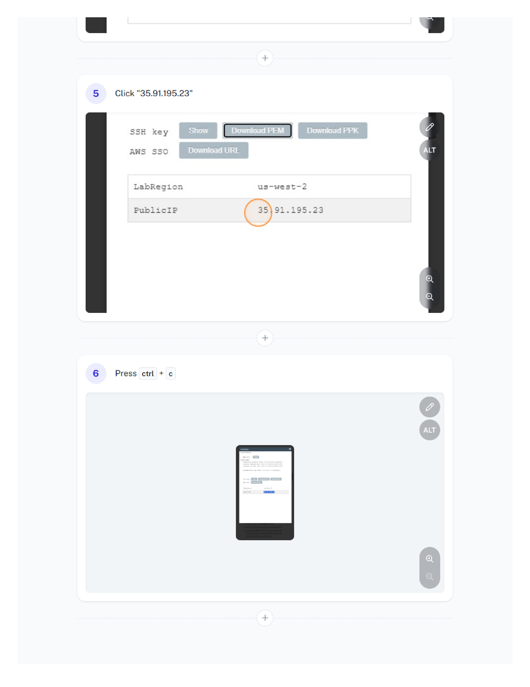
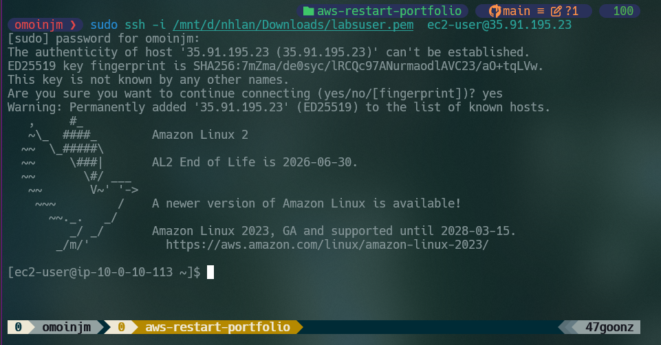

### Task 2: Exercise - run the Vim tutorial

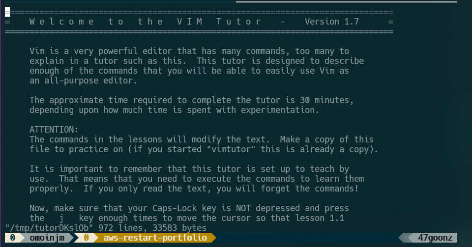
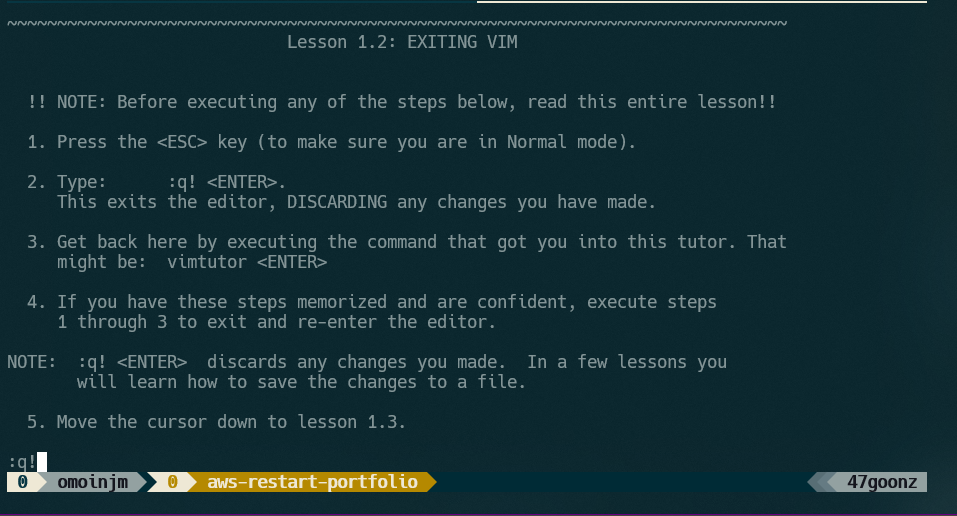
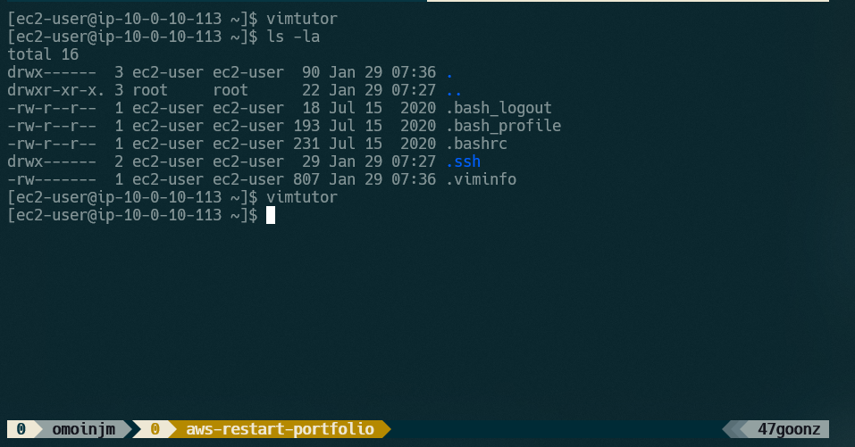

### Task 3: Exercise - edit a file in Vim

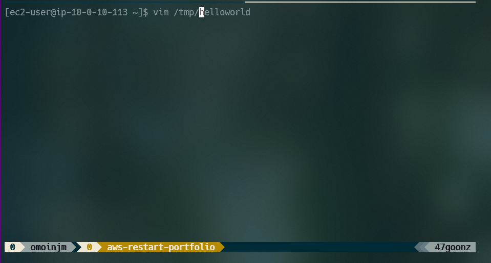
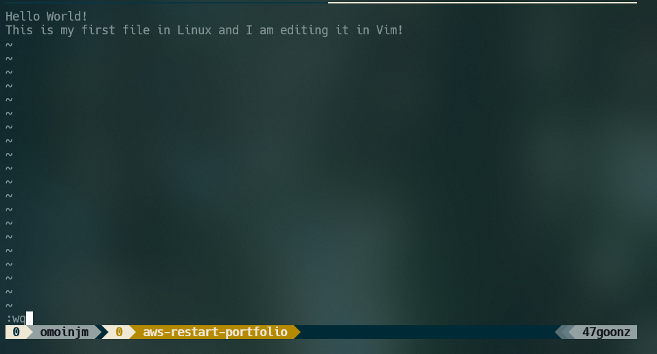
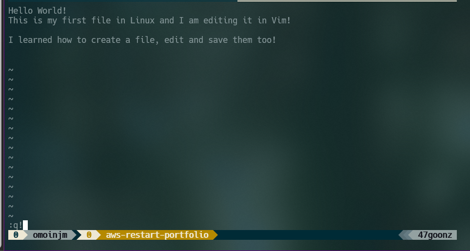
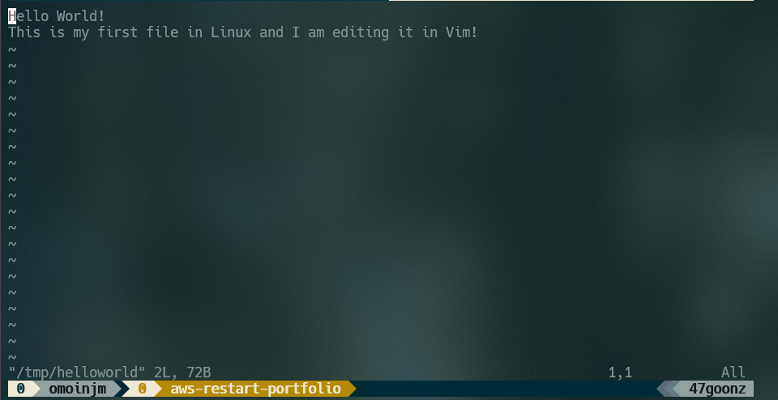
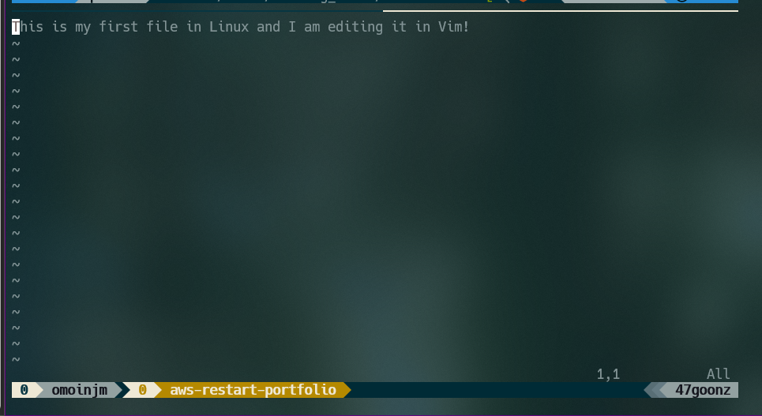
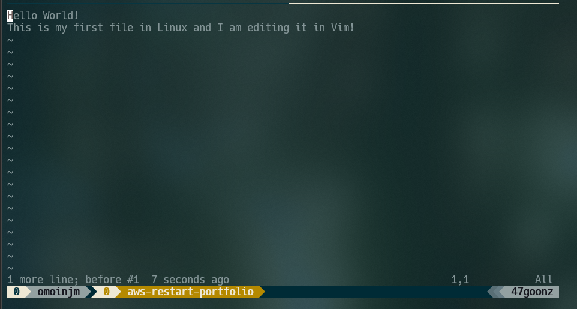

### Task 4: Exercise - edit a file in nano

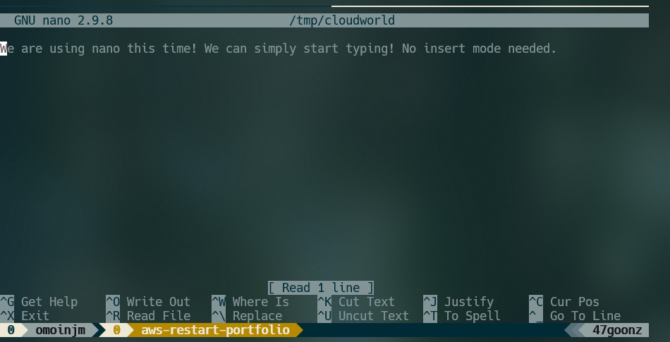
