# Linux Command Line

## Navigation
- ⬆ Parent: [[../README]]
- 🏠 Root: [[../../../README]]
- 📂 Current: [[./]]

In this lab, you will:

- Run commands to gain knowledge of your current system and current session
- Search and run previous bash commands

## 📋 Instructions

For a detailed step-by-step guide on how this environment was configured, please refer to the documentation:

- [[./task.md|View Instructions]]

## Contents

- `assets/` - [[./assets/README|Screenshots and supporting materials]]
- `task.md` - Detailed lab instructions

---

## ✅ Lab Completion Results

The following images document the successful completion of the AWS EC2 Lab.

### Documentation Gallery

#### Task 1: Use SSH to connect to an Amazon Linux EC2 instance

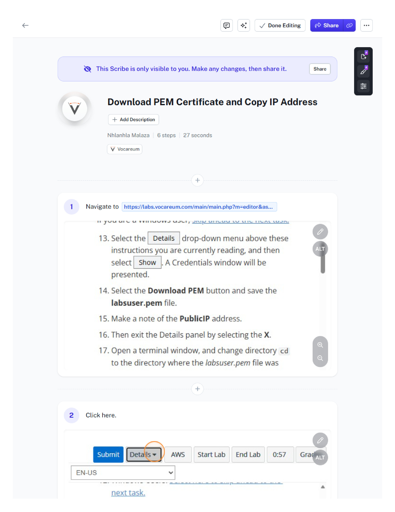
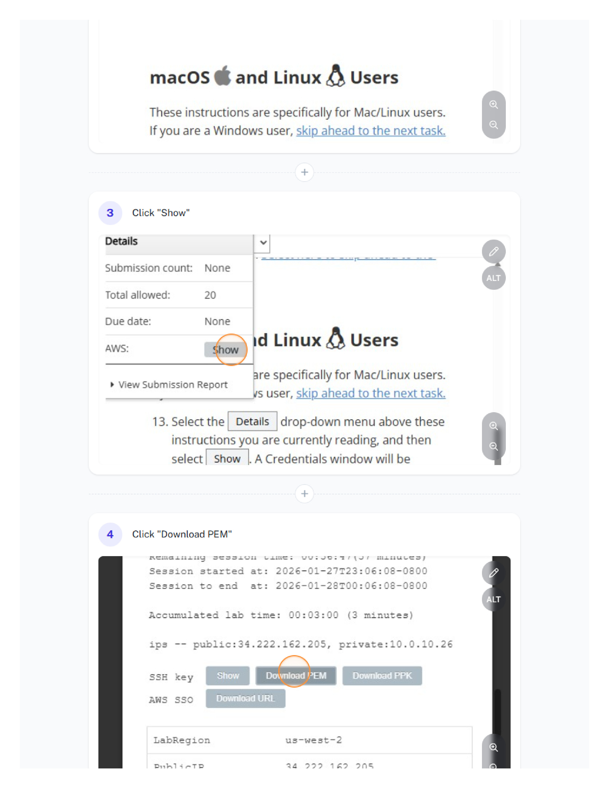
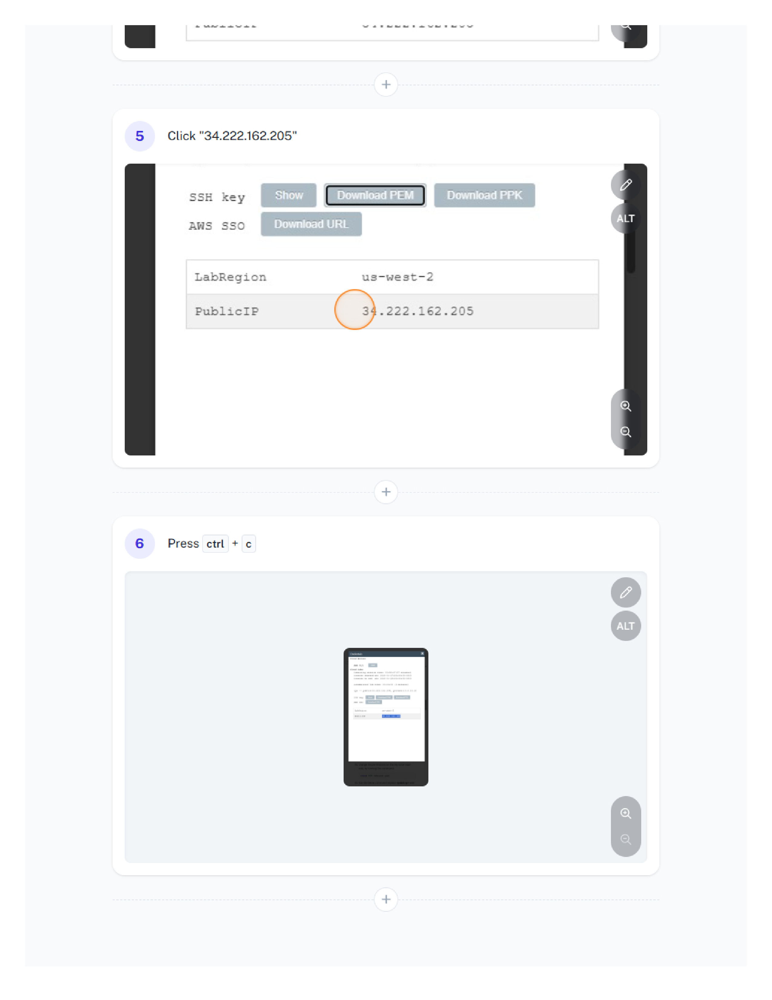
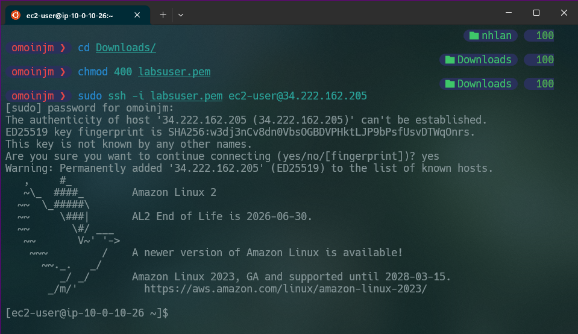

#### Task 2: Run familiar commands

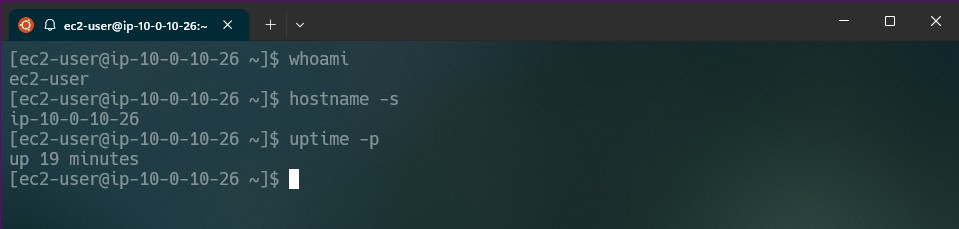
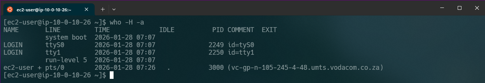
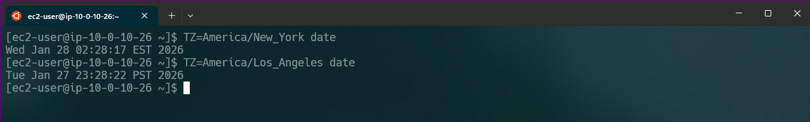
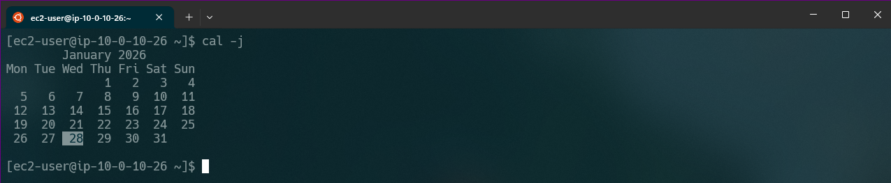
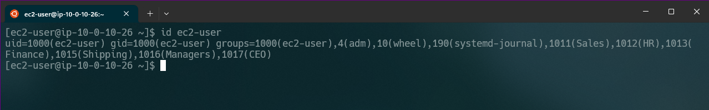

#### Task 3: Improve workflow through history and search

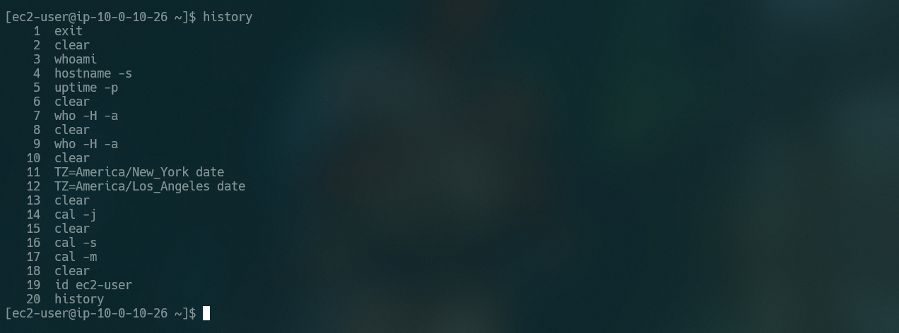
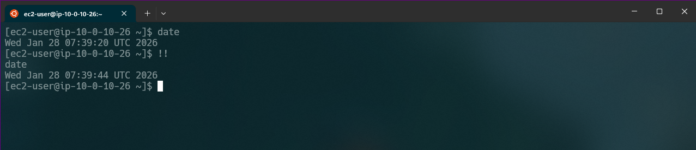
