# Users and Groups

## Navigation

- [⬆ Parent](../README.md)
- [🏠 Root](../../README.md)
- [📂 Current](./README.md)

## Overview

This lab focuses on **Linux user and group management**—fundamental system administration tasks. Covers creating users, managing groups, setting permissions, and understanding the Linux permission model.

## 📋 Instructions

For a detailed step-by-step guide on how this environment was configured, please refer to the documentation:

- [View Instructions](./task.md)

## Contents

- `assets/` - Screenshots and supporting materials
- `task.md` - Detailed lab instructions

## ✅ Lab Completion Results

The following images document the successful completion of the Managing Users and Groups Lab.

### Task 1: Use SSH to connect to an Amazon Linux EC2 instance

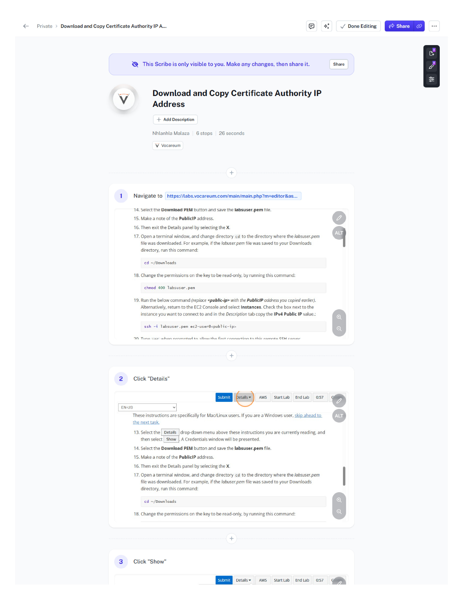
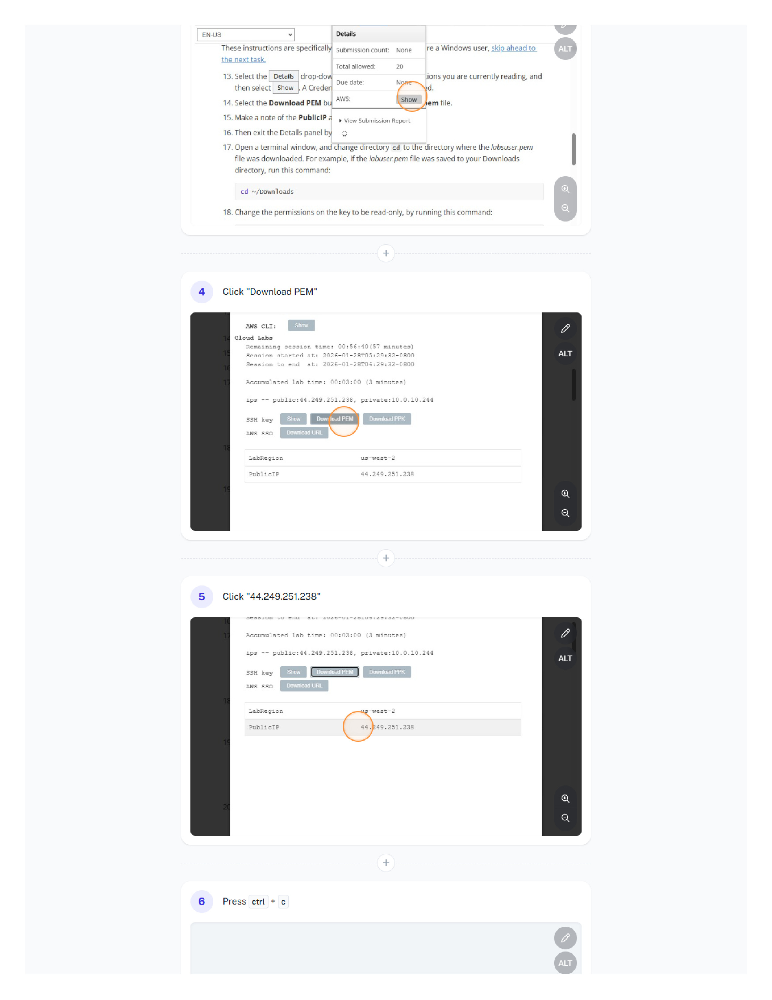

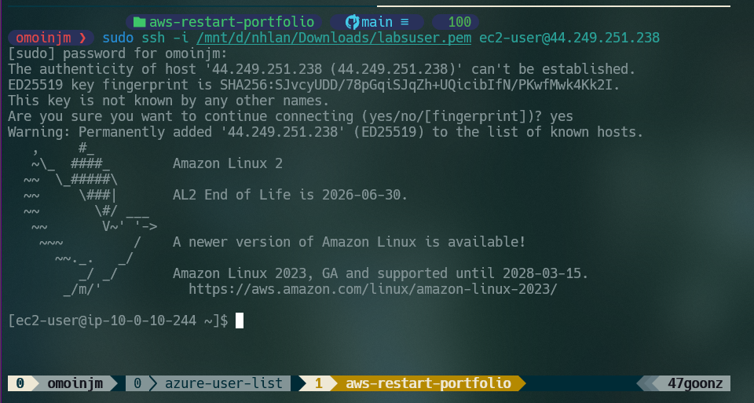

### Task 2: Create Users

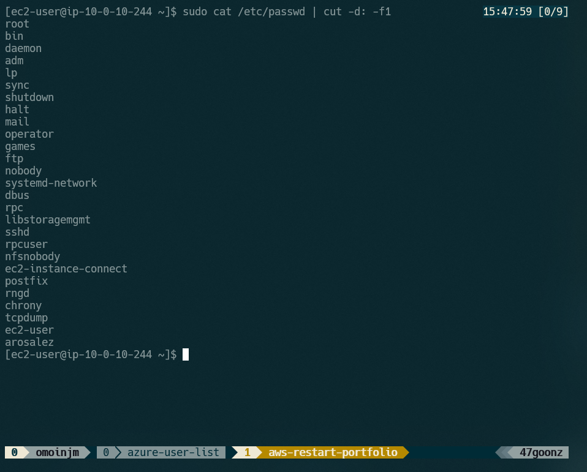
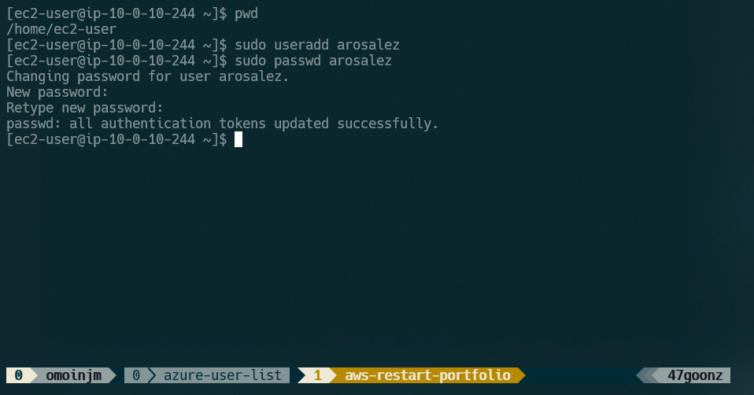
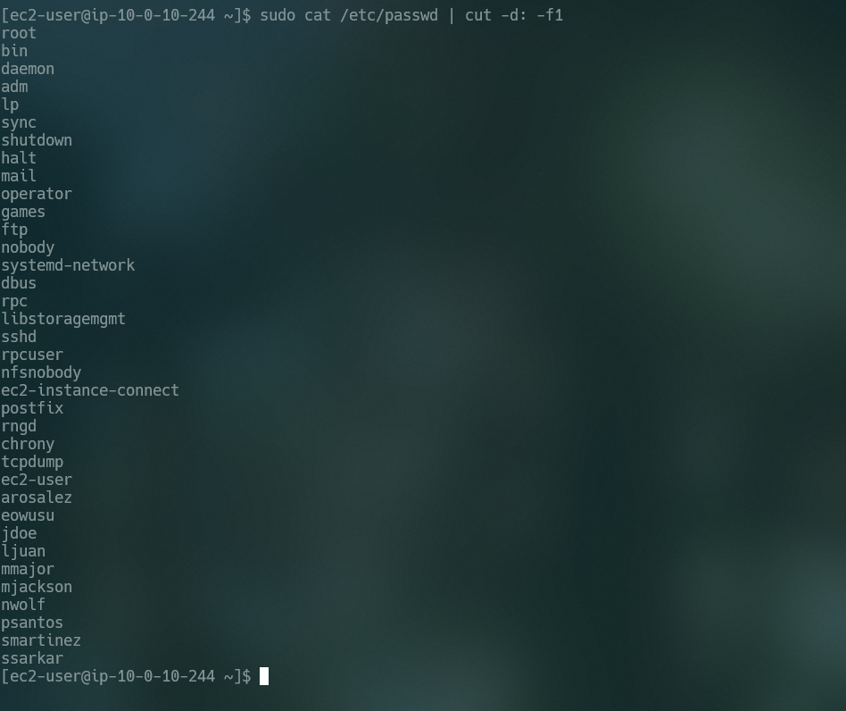

### Task 3: Create Groups

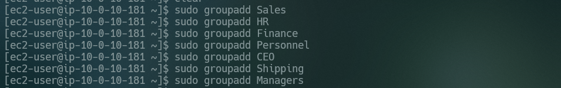
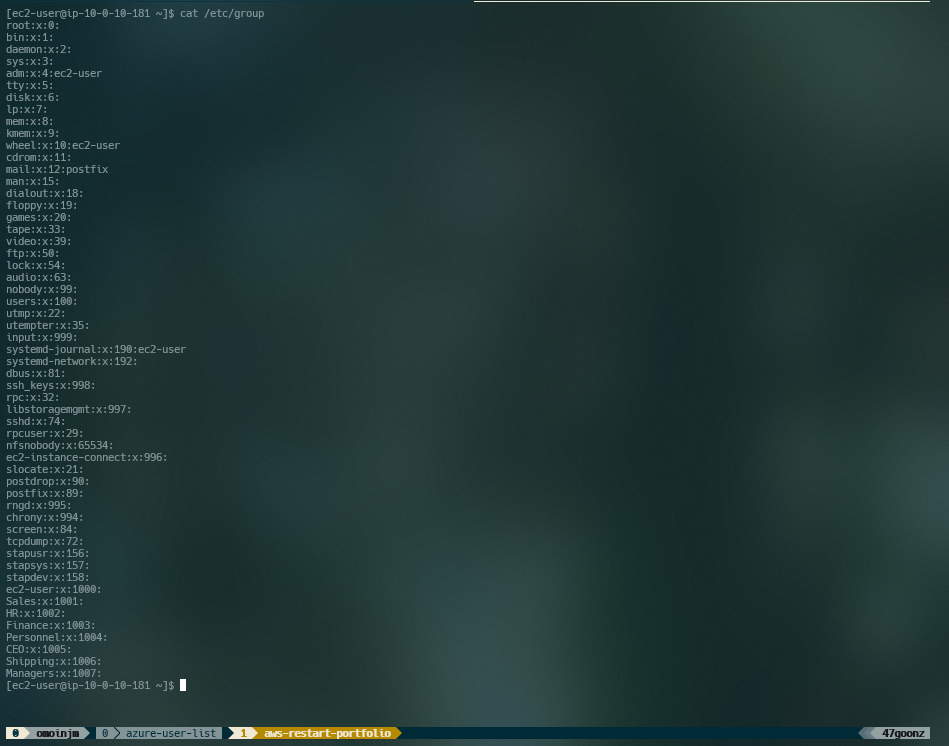
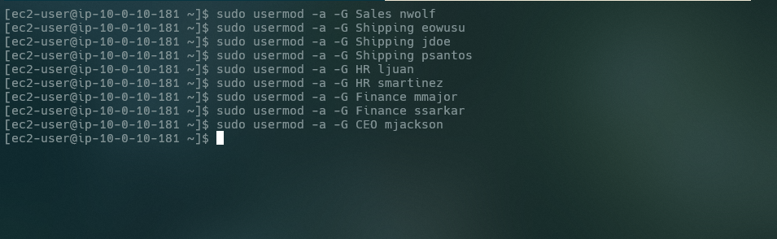
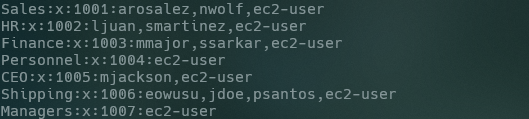

### Task 4: Log in using the new users

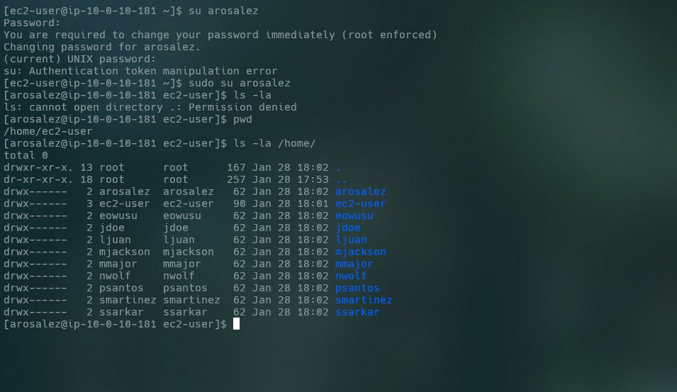
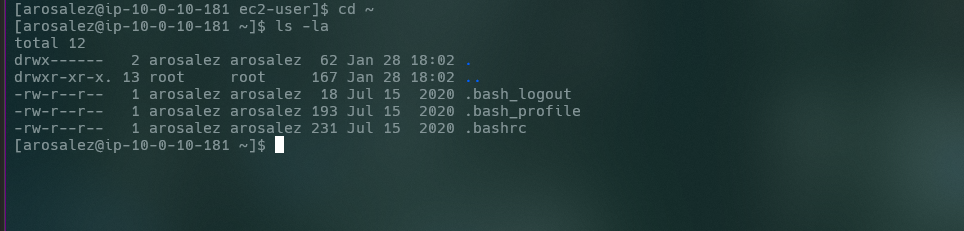
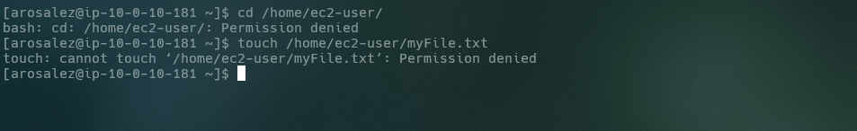
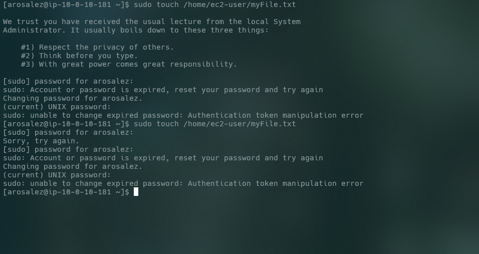
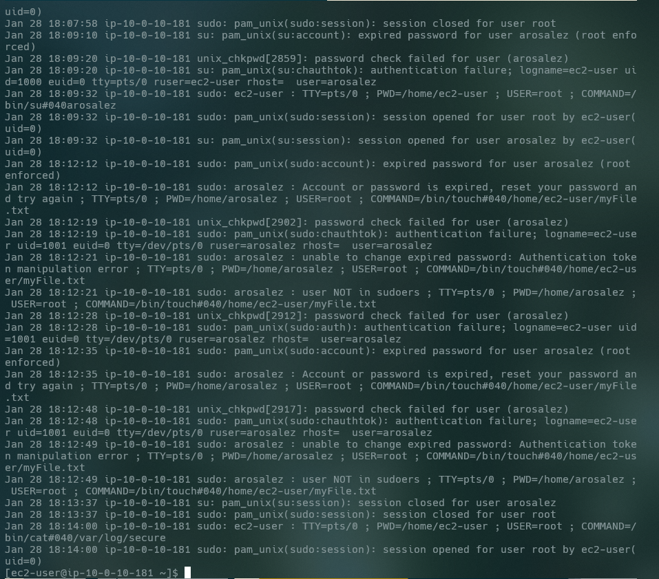
