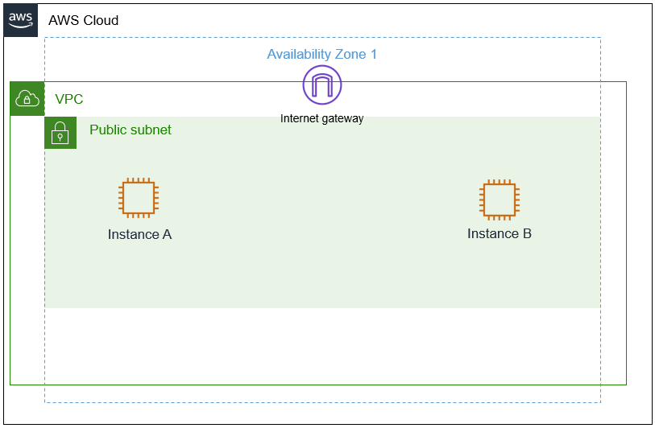
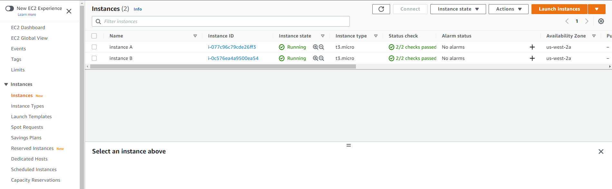
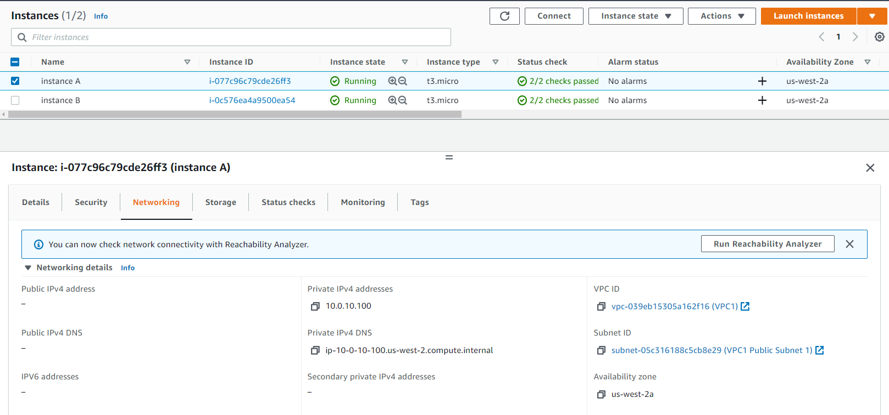
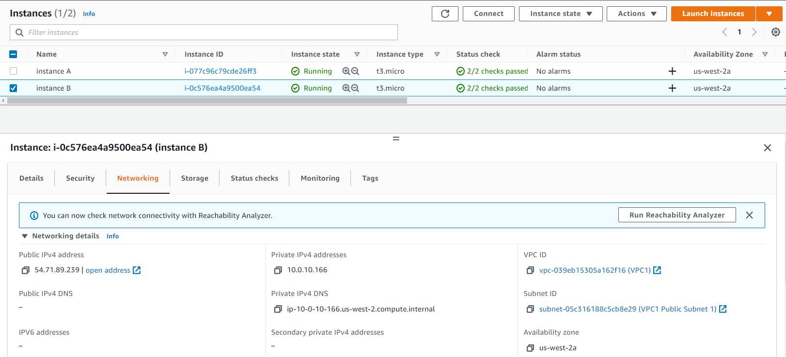

# 📖 Public & Private IPs Instructions

## 🔗 Navigation

- [⬆ Parent](./README.md)
- [🏠 Root](../../../README.md)
- [🌐 Networking Hub](../../README.md)

---

## Objectives

In this lab, you will:

- Summarize and investigate the customer scenario
- Analyze the difference between a private and public IP address
- Develop a solution to the customer's issue in this lab
- Summarize and describe your findings (group activity)

#### Duration

This lab requires approximately **1 hour** to complete.

#### Scenario

Your role is a cloud support engineer at Amazon Web Services (AWS). During your shift, a customer from a Fortune 500 company requests assistance regarding a networking issue within their AWS infrastructure. The following is the email and an attachment regarding their architecture:

#### Ticket from your customer

Hello, Cloud Support!

> We currently have one virtual private cloud (VPC) with a CIDR range of 10.0.0.0/16. In this VPC, we have two Amazon Elastic Compute Cloud (Amazon EC2) instances: instance A and instance B. Even though both are in the same subnet and have the same configurations with AWS resources, instance A cannot reach the internet, and instance B can reach the internet. I think it has something to do with the EC2 instances, but I'm not sure. I also had a question about using a public range of IP address such as 12.0.0.0/16 for a VPC that I would like to launch. Would that cause any issues? Attached is our architecture for reference.

> Thanks!

> Jess

> Cloud Admin



_Figure: The customer's architecture, which consists of a VPC, internet gateway, public subnet with instance A, and a public subnet with instance B._

#### AWS service restrictions

In this lab environment, access to AWS services and service actions might be restricted to the ones that you need to complete the lab instructions. You might encounter errors if you attempt to access other services or perform actions beyond the ones that this lab describes.

#### Accessing the AWS Management Console

1. At the top of these instructions, choose Start Lab to launch your lab.

   A **Start Lab** panel opens, and it displays the lab status.

> **Tip**: If you need more time to complete the lab, choose the Start Lab button again to restart the timer for the environment.

2. Wait until you see the message Lab status: ready, then close the **Start Lab** panel by choosing the **X**.

3. At the top of these instructions, choose AWS.

   This opens the AWS Management Console in a new browser tab. The system will automatically log you in.

> **Tip**: If a new browser tab does not open, a banner or icon is usually at the top of your browser with a message that your browser is preventing the site from opening pop-up windows. Choose the banner or icon and then choose **Allow pop ups**.

4. Arrange the AWS Management Console tab so that it displays along side these instructions. Ideally, you will be able to see both browser tabs at the same time so that you can follow the lab steps more easily.

## Task 1: Investigate the customer's environment

Recall that you previously covered public and private IP addresses and CIDRs. As you go through this lab, think about the differences between public and private IP addresses for task 1. For task 2, think about the importance of using private IP ranges rather than public IP ranges.

> **Note**

> For this lab, you have already checked the AWS architecture, and everything is routed and attached correctly. This lab does not cover any AWS architecture.

In the scenario, Jess, who is the customer requesting assistance, has two EC2 instances in one VPC. Instance A cannot reach the internet, and instance B can even though they are configured the same within the VPC. Currently, the customer's AWS architecture seems sound because one of their instances works. Jess suspects that the instance configuration may be the issue.

She also has a question about using a public range of IP addresses for the new VPC and has asked if you could provide further insight on her question.

You currently have one VPC with the same CIDR of 10.0.0.0/16 with two instances — instance A and instance B — with the same configurations as the customer. When troubleshooting networking and AWS, you can apply a troubleshooting method where you start from the top and work your way down or start from the bottom and work your way up. You start troubleshooting from the bottom and work your way to the top in layers using an example such as the OSI model. At the very bottom of this architecture is the EC2 instance. Although the cloud architecture does not directly translate to the OSI model, the following is an example of how the OSI and cloud relate.

|             | **OSI Model**                                           | **AWS infrastructure**           |
| ----------- | ------------------------------------------------------- | -------------------------------- |
| **Layer 7** | Application (how the end user sees it)                  | Application                      |
| **Layer 6** | Presentation (translator between layers)                | Web Servers, application servers |
| **Layer 5** | Session (session establishment, security)               | EC2 instances                    |
| **Layer 4** | Transport (TCP, flow control)                           | Security group. NACL             |
| **Layer 3** | Network (Packets which contain IP addresses)            | Route Tables, IGW, Subnets       |
| **Layer 2** | Data Link (Frames which contain physical MAC addresses) | Route Tables, IGW, Subnets       |
| **Layer 1** | Physical (cables, physical transmission bits and volts) | Regions, Availability Zones      |

_Table: This is an example of how the AWS infrastructure and its resources have similarities to the OSI model. This information can be beneficial when troubleshooting._

    For task 1, you gain an understanding of the customer's environment and replicate their issue.

5. At the upper-right of these instructions, choose **AWS**. The AWS Management Console opens in a new tab.

6. Once you are in the AWS console, type and search for **EC2** in the search bar on the top-left corner. Select EC2 from the list.

Tip: Alternatively, You can also find EC2 under **Services - Compute** in the top left corner


_Figure: The search bar can be used to find the Amazon EC2 service. Once you find the service, select it._

7. You are now in the Amazon EC2 dashboard. In the left navigation menu, choose **Instances**. This option takes you to your current EC2 instances. You should currently see two EC2 instances.



_Figure: Amazon EC2 dashboard_

8. Please copy and paste the names and IP addresses of both instances for future reference in a text editor.
   Select the check box next to **instance A**. At the bottom of the page, choose the **Networking tab**, and note the **Public** and **Private** IPv4 addresses. Once you copy and paste the name and IP addresses, deselect the instance, and then select **instance B** and do the same. Did you notice any differences? Note them if you did.



_Figure: Amazon EC2 instance A networking information. The IP address values may vary._



_Figure: Amazon EC2 instance B networking information. The IP address values may vary._

## Task 2: Use SSH to connect to an Amazon Linux EC2 instance

In this task, you will connect to a Amazon Linux EC2 instance. You will use an SSH utility to perform all of these operations. The following instructions vary slightly depending on whether you are using Windows or Mac/Linux.

#### Windows Users: Using SSH to Connect

These instructions are specifically for Windows users. If you are using macOS or Linux, [skip to the next section](#Task 3).

9. Select the Details drop-down menu above these instructions you are currently reading, and then select Show. A Credentials window will be presented.

10. Select the **Download PPK** button and save the **labsuser.ppk** file.
    _Typically your browser will save it to the Downloads directory._

11. Make a note of the **PublicIP** address.

12. Then exit the Details panel by selecting the **X**.

13. Download **PuTTY** to SSH into the Amazon EC2 instance. If you do not have PuTTY installed on your computer, download it here.

14. Open **putty.exe**

15. Configure your PuTTY session by following the directions in the following link: Connect to your Linux instance using PuTTY

16. Windows Users: Select here to skip ahead to the next task.

#### macOS and Linux Users

These instructions are specifically for Mac/Linux users. If you are a Windows user, skip ahead to the next task.

17. Select the Details drop-down menu above these instructions you are currently reading, and then select Show. A Credentials window will be presented.

18. Select the Download PEM button and save the labsuser.pem file.

19. Then exit the Details panel by selecting the X.

20. Open a terminal window, and change directory cd to the directory where the labsuser.pem file was downloaded. For example, if the labuser.pem file was saved to your Downloads directory, run this command:

```bash
cd ~/Downloads
```

21. Change the permissions on the key to be read-only, by running this command:

```bash
chmod 400 labsuser.pem
```

22. Run the below command \*(replace <ip-address> with the IPv4 address of instance A you made a note of earlier. Note: Should you use a Public or Private IP address to connect?

```bash
ssh -i labsuser.pem ec2-user@<ip-address>
```

23. Type yes when prompted to allow the first connection to this remote SSH server.
    Because you are using a key pair for authentication, you will not be prompted for a password.

> **Question** - Were you able to use the SSH to connect to both instances? Why or why not?

> **Answer**: If you were not able to connect to instance A, it was due to this instance being assigned only a private IP address. Private IP addresses cannot be accessed from outside the VPC. This is why you are only able to connect to instance B. Instance B has a public IP address assigned to it allowing access from outside the VPC, which allows you to use the SSH utility to connect to the instance.

> The customer asked for your insight regarding using a public CIDR for a new VPC that she would like to launch. Refer to module 4 and gather some evidence and summarize a short explanation of your findings to explain to the customer why or why not you recommend this approach.

## Task 3: Send the Response to the customer (group activity)

In groups of two, submit your findings.

Person 2 will act as Jess the customer, and Person 1 will act as the cloud support engineer. Person 1 will talk over their findings with person 2.

> **Note**

> This task should take only 5-10 minutes. If a group activity is not possible due to COVID, please have one student walk through their findings to the class.

## Lab Complete

Congratulations! You have completed the lab.

24. Select End Lab at the top of this page and then select Yes to confirm that you want to end the lab.
    A panel will appear, indicating that "DELETE has been initiated... You may close this message box now."

25. Select the X in the top right corner to close the panel.

## Recap

In this lab you have investigated the customer's environment and applied troubleshooting techniques that allowed you to resolve the customers’ issue. Within the scenario, you discovered that the customer's EC2 instance (instance A) needed a public IP address to connect to the internet. This was tested by using an SSH utility to connect to the instance. Private IP addresses are used within the VPC and cannot establish a connection to the internet. As module 4 noted, you discovered that using a public range of IP addresses for a VPC can result in complications from having replies back from other unrelated resources.
