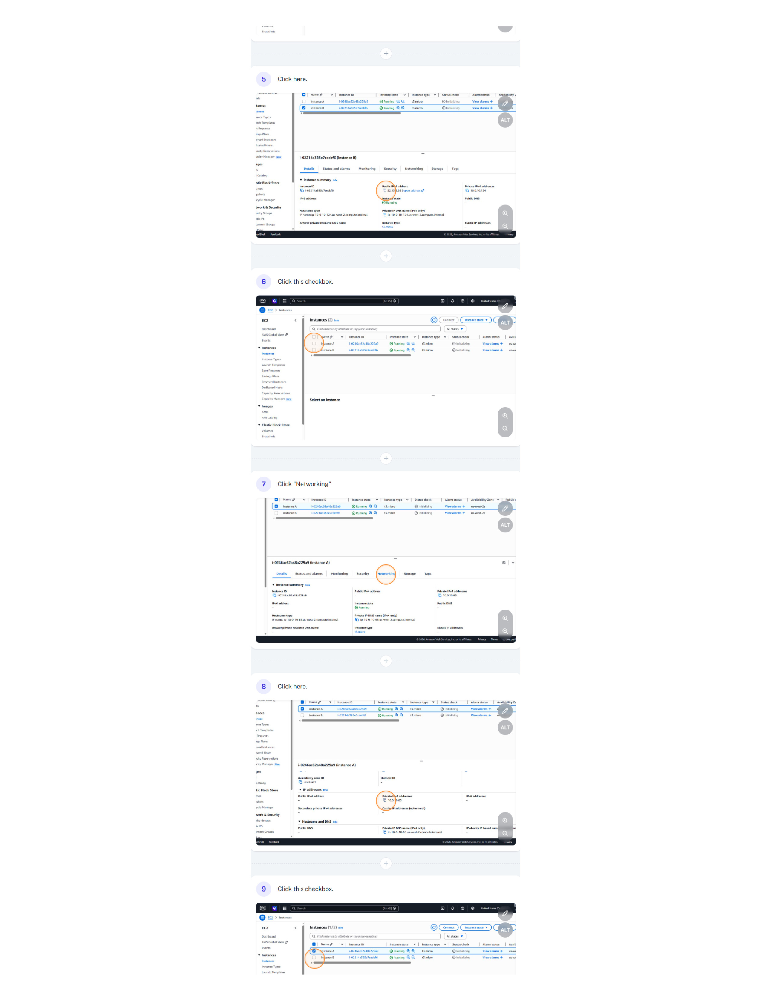
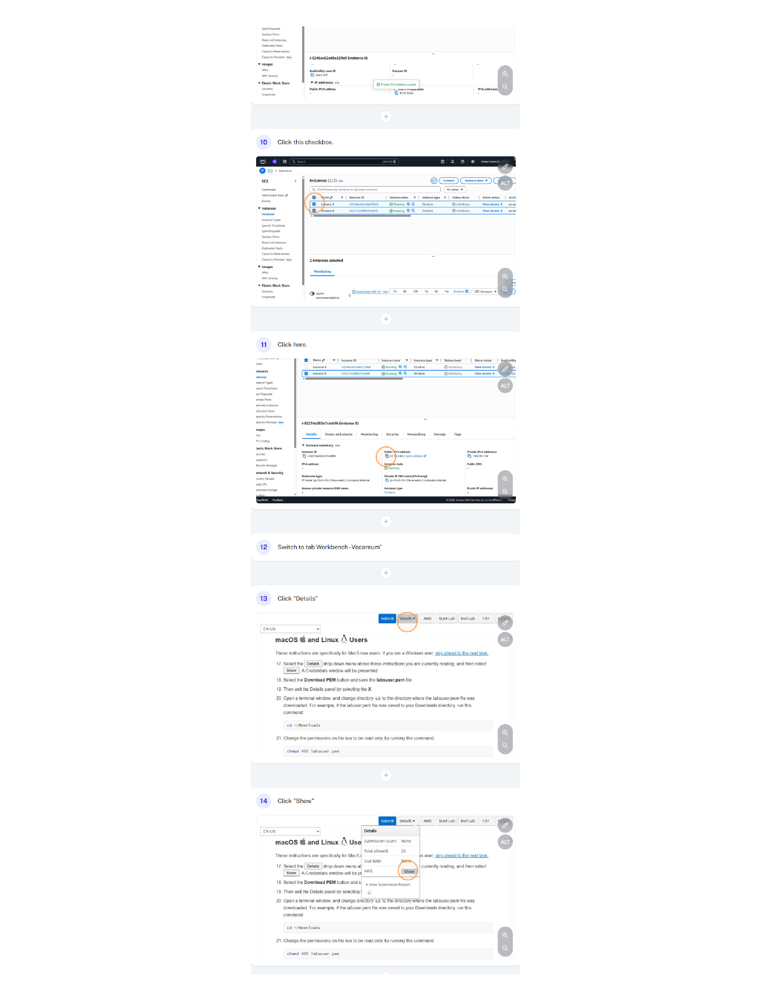
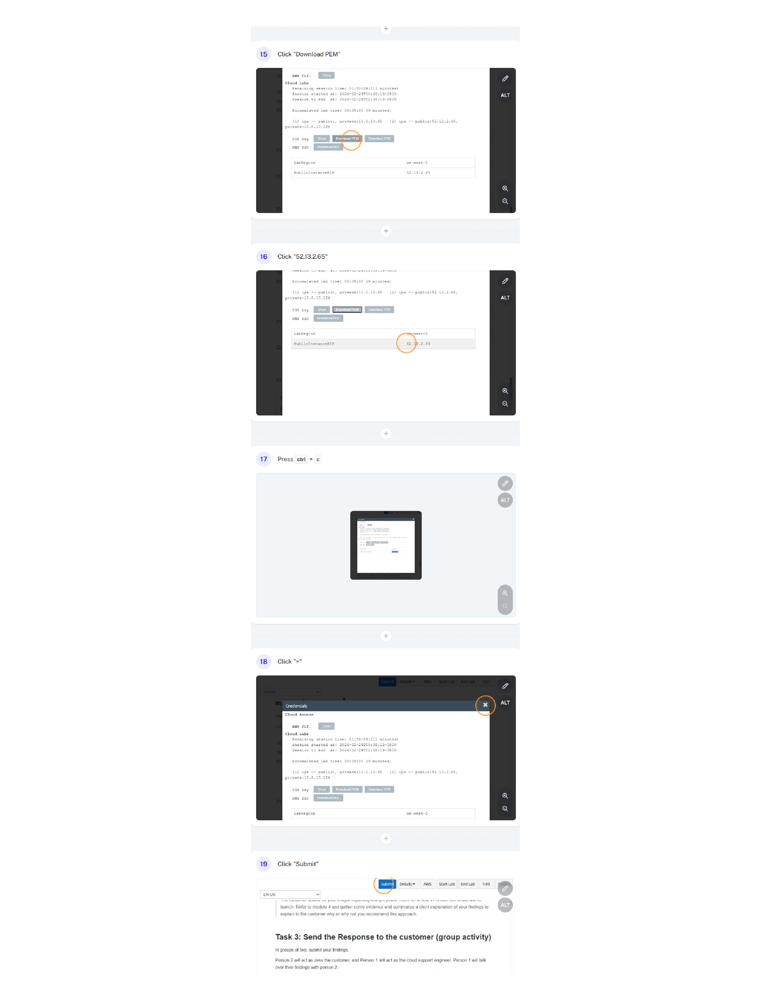
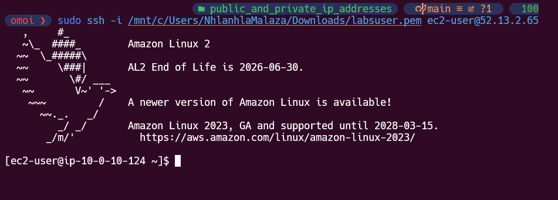
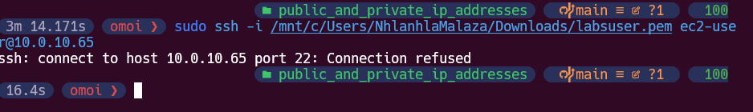

# 🌐 Public & Private IPs

## 🔗 Navigation

- [⬆ Parent](../README.md)
- [🏠 Root](../../../README.md)
- [📂 Current](./README.md)

---

## 📌 Overview

In this lab, I investigated a customer scenario involving connectivity issues to EC2 instances. I analyzed the differences between private and public IP addresses and developed a solution for secure cloud access.

---

## 📁 Contents

| Resource | Description |
| :--- | :--- |
| [📋 Instructions](./Instructions.md) | Detailed step-by-step guide on the configuration and investigation process. |
| `assets/` | Screenshots and supporting materials captured during the lab. |

---

## 🧠 Responsibilities

- **Network Analysis:** Investigating connectivity issues based on IP address types.
- **Troubleshooting:** Identifying why certain instances are unreachable from the public internet.
- **Protocol Understanding:** Distinguishing between IPv4 public and private address spaces.

---

## 🔄 Relationships

- **Upstream:** Part of the [Networking Hub](../README.md).
- **Interconnects:** Uses [EC2](../../../Labs/Compute/README.md) instances for connectivity testing.

---

## ✅ Lab Completion Results

The following images document my successful completion of the **Internet Protocols - Public and Private IP addresses** Lab.

### Documentation Gallery

#### Task 1: Investigate the customer's environment

#### Task 2: Use SSH to connect to an Amazon Linux EC2 instance

#### Task 3: Send the Response to the customer (group activity)

> I found that I could only connect to **InstanceB** which had a public IP address and could not connect to **InstanceA** as there was no public IP address, there is only a private IP addresses.
