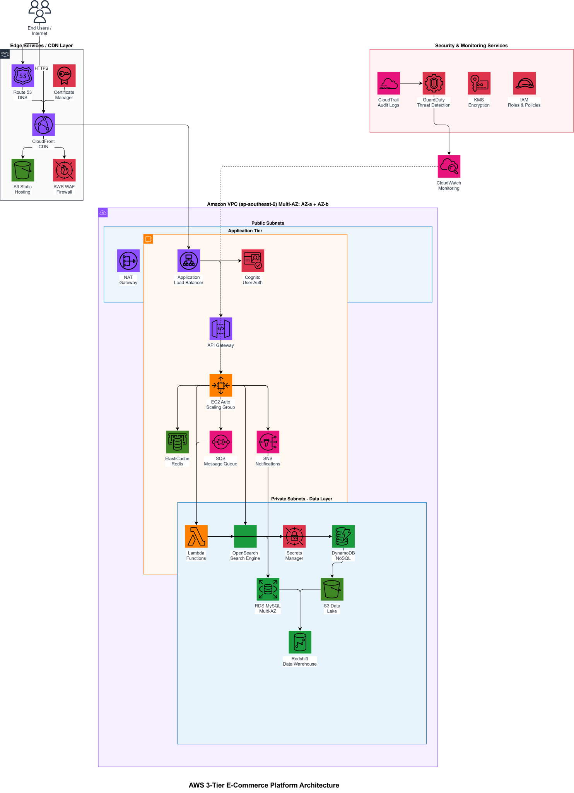

# 🏗️ 3D Application — AWS Cloud Architecture

> A highly available, scalable, and secure cloud infrastructure for a 3D application deployed on AWS.

[View Instructions](./Instructions.md)

---

## 📐 Architecture Diagram

---

## 📚 Documentation

| Resource | Description |
|----------|-------------|
| 📖 [Architecture Explanation](./ARCHITECTURE.md) | Full technical write-up of every layer |

---

## 🧱 Architecture Overview

The system is structured across **5 core layers**:

| Layer | Services | Purpose |
|-------|----------|---------|
| 🌐 **Edge & DNS** | Route 53 · CloudFront · WAF | Global routing, CDN, DDoS protection |
| 🔒 **Network (VPC)** | ALB · NAT Gateway · Subnets | Isolation, traffic distribution |
| ⚙️ **Compute** | EC2 Auto Scaling · Lambda | Backend processing, serverless tasks |
| 🗄️ **Database** | RDS (Multi-AZ) · DynamoDB | Relational & NoSQL data storage |
| 📦 **Storage** | S3 | 3D models, assets, backups |
| 📊 **Monitoring** | CloudWatch · IAM | Observability, access control |

---

## ☁️ AWS Services Used

### 🌍 Edge Layer
-  **Amazon Route 53** — DNS resolution & health checks
-  **Amazon CloudFront** — Global content delivery network
-  **AWS WAF** — Web Application Firewall

### 🔗 Network Layer
- 🏠 **VPC** — Multi-AZ Virtual Private Cloud
- ⚖️ **Application Load Balancer (ALB)** — Traffic distribution
- 🌿 **NAT Gateway** — Secure outbound internet access

### ⚙️ Compute Layer
-  **Amazon EC2** — Auto Scaling Group across AZs
-  **AWS Lambda** — Event-driven, serverless processing

### 🗄️ Database Layer
-  **Amazon RDS** — Relational DB with automatic failover
-  **Amazon DynamoDB** — Low-latency NoSQL

### 📦 Storage Layer
-  **Amazon S3** — 3D models, media, backups (11 9's durability)

### 📊 Monitoring & Security
-  **Amazon CloudWatch** — Metrics, logs, and alerts
-  **AWS IAM** — Role-based access & least privilege

---

## ✅ Key Design Principles

- 🔁 **High Availability** — Multi-AZ deployment with automatic failover
- 📈 **Scalability** — Auto Scaling + DynamoDB on-demand capacity
- 🔐 **Security** — WAF + private subnets + encryption at rest & in transit
- 💸 **Cost Efficiency** — Serverless Lambda + Auto Scaling + S3 lifecycle policies
- 🌍 **Global Performance** — CloudFront edge locations worldwide

---

## 📄 License

MIT © 2025 — Your Organization
