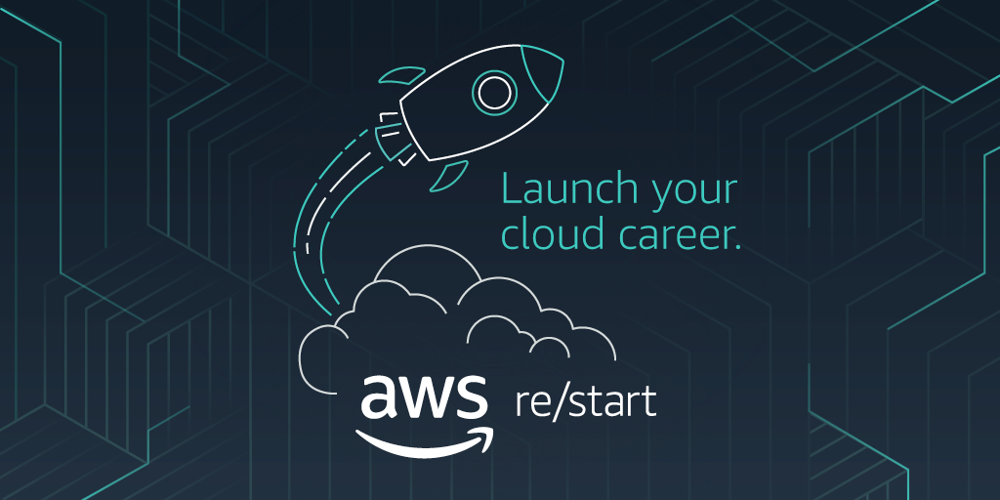

## [](https://github.com/omoinjm/aws-restart-portfolio/graphs/contributors/) [](https://github.com/omoinjm/aws-restart-portfolio/stargazers)



---

## About This Repository

This repository documents my learning journey and hands-on experience through the **AWS re/Start Program**.  
The program is designed to take individuals from beginner level to **job-ready cloud practitioners**, with a strong focus on practical skills, real-world scenarios, and professional documentation.

This repository serves as:

- 📊 A **portfolio** to showcase my AWS labs and projects
- ✅ Evidence of **hands-on cloud experience**
- 📚 A structured **learning record** aligned with industry expectations
- 🔄 A resource I can revisit to reinforce concepts and best practices

---

## What I Learned in AWS re/Start

During the program, I gained exposure to the following key areas:

### ☁️ Cloud Computing (AWS)

| Service                                                   | Purpose                                     |
| --------------------------------------------------------- | ------------------------------------------- |
|  **EC2**                      | Compute instances for scalable applications |
|  **S3**                         | Object storage for data persistence         |
|  **IAM**                      | Identity and access management              |
|  **VPC**                      | Virtual private cloud networking            |
|  **RDS**                      | Managed relational databases                |
|  **Lambda**             | Serverless compute functions                |
|  **CloudWatch** | Monitoring and logging                      |

### 🌐 Networking & Security

- 🔌 Networking basics (CIDR, subnets, routing)
- 🛡️ VPC design concepts
- 🔒 Security best practices
- 👤 Identity and Access Management (IAM)
- ↔️ Shared Responsibility Model

### 💾 Databases & Storage

- 📊 Relational vs NoSQL databases
- 🏗️ AWS storage options and use cases
- 💿 Data persistence and backups

### 🧑‍💻 Programming & Automation

- 🐍 Python fundamentals
- 🤖 Scripting for automation
- 🧠 Logic building and problem-solving
- 🔗 Using scripts to interact with systems and services

### 🛠️ Professional & DevOps Skills

- 📝 Git & GitHub version control
- 📖 Writing clear technical documentation
- 📁 Structuring repositories professionally
- ✨ Working with labs, tasks, and outcomes

---

## 📁 Repository Structure

```
aws-restart-portfolio/
├── 🧪 Labs/
│   ├── 🌐 Networking/
│   ├── 🖥️ Compute/
│   ├── 💾 Storage/
│   ├── 📊 Databases/
│   ├── 🔒 Security/
│   └── 👾 Linux/
├── 🚀 Projects/
├── 🎓 Certs-Badges/
└── 📦 assets/
```

## Navigation

- [[./Labs/README|Labs]] - Hands-on AWS labs by service domain
- [[./Projects/README|Projects]] - Portfolio projects showcasing skills
- [[./Certs-Badges/README|Certs-Badges]] - Certifications and achievements
- [[./assets/README|Assets]] - Shared resources and icons

| Aspect                        | Impact                                                       |
| ----------------------------- | ------------------------------------------------------------ |
| 🎯 **Practical Knowledge**    | Demonstrates real AWS experience, not just theory            |
| 📢 **Communication Skills**   | Shows ability to document and explain technical work clearly |
| 📈 **Growth & Progress**      | Reflects consistency, structure, and continuous learning     |
| 💼 **Professional Portfolio** | Acts as a digital CV for cloud and junior IT roles           |

---

## AWS Services Covered

```
┌─────────────────────────────────────────────────────┐
│            🌟 AWS re/Start Program 🌟              │
├─────────────────────────────────────────────────────┤
│  ☁️ COMPUTE       🗄️ DATABASES     🔒 SECURITY     │
│  • EC2             • RDS            • IAM           │
│  • Lambda          • DynamoDB       • VPC           │
│  • ECS             • MongoDB        • CloudTrail    │
│                                                     │
│  💾 STORAGE       🌐 NETWORKING   🛠️ DEVOPS        │
│  • S3              • VPC            • CloudWatch    │
│  • EBS             • Route 53       • CloudFormation│
│  • Glacier         • ALB/NLB        • Git/GitHub    │
└─────────────────────────────────────────────────────┘
```

---

## Continuous Improvement

This is a **living repository** 🌱 and will be updated as I continue learning and building.

---

## Author

**Nhlanhla Malaza** 👨‍💻  
AWS re/Start Graduate 🎓  
Aspiring Cloud Practitioner / Junior Cloud Engineer ☁️
